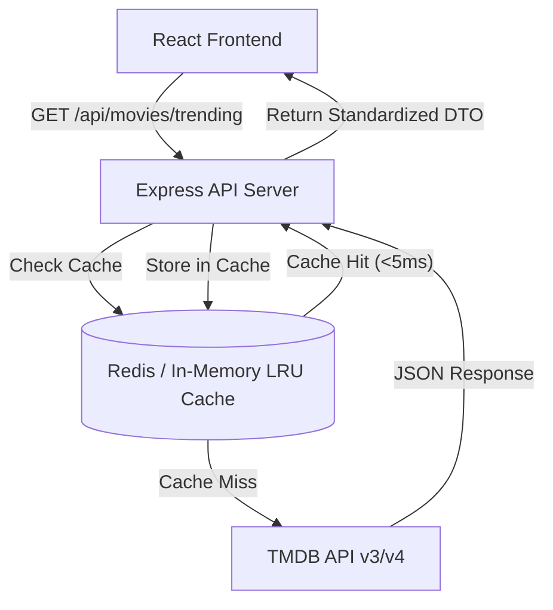

# FilmyFrolic: Technical Evaluation, Security Audit & Architectural Roadmap

**Author**: Senior Software Architect & Cybersecurity Specialist (23+ Years Experience)  
**Date**: August 2026  
**Target Project**: `filmyfrolic` (React Frontend + Express/Supabase Backend)

---

## 1. Production Readiness Score: **35% - 40% (MVP / Prototype Stage)**

While FilmyFrolic has a rich domain feature set (Communities, Rooms/Agora Watch Parties, Gossips, Memes, Admin Panel, Watchlist), it is currently **not production-ready** for high-concurrency public launch. It exhibits typical prototype patterns that need hardening before handling real traffic and user data securely.

### Production Readiness Breakdown

| Pillar                    |   Score    | Current Status & Gaps                                                                                                                         |
| :------------------------ | :--------: | :-------------------------------------------------------------------------------------------------------------------------------------------- |
| **Security & Auth**       | ⚠️ **40%** | Basic Supabase JWT check present. Missing strict CORS limits, global rate limiting, RLS enforcement checks, and API parameter sanitization.   |
| **Backend Resilience**    | 🔴 **30%** | Express 5 initialized without centralized error handling middleware. Upstream dependency on third-party mock service (`filmydock` on Render). |
| **Database & Schema**     | ⚠️ **45%** | Relational model established in `db_schema.sql`, but lacks composite indexes for feeds, search, and foreign key cascades.                     |
| **Frontend Architecture** | 🟢 **65%** | Modern React 18 + Vite + Tailwind CSS stack with clean folder module division. Needs state management cleanup and build chunk optimization.   |
| **Testing & CI/CD**       | 🔴 **0%**  | Zero automated tests (unit, integration, or E2E). No automated GitHub Actions deployment or verification pipeline.                            |
| **Observability**         | 🔴 **10%** | Relies solely on unformatted `console.log`/`console.error`. No structured logging (Pino/Winston) or crash reporting (Sentry).                 |

---

## 2. Cybersecurity & Architectural Deep Dive

### A. Critical Security Concerns

1. **Unrestricted CORS (`cors()`)**: `app.js` calls `app.use(cors())` without specifying allowed origin origins (`origin: process.env.ALLOWED_ORIGINS`). In production, this opens cross-origin API access to arbitrary domain scripts.
2. **Service Role Key Overhead**: Backend uses `SUPABASE_SERVICE_ROLE_KEY` for Supabase client queries. Service Role keys bypass Row-Level Security (RLS). Every backend controller must manually check permissions, or user context must be passed down safely to avoid privilege escalation.
3. **Missing Global Rate Limiting**: `express-rate-limit` is installed in `package.json` but not enabled in `app.js` globally or on auth/write endpoints. This leaves public routes vulnerable to Denial of Service (DoS) or credential stuffing attacks.
4. **Third-Party Upstream Vulnerability**: `home.filmydock.service.js` directly proxies requests to `https://filmydock-backend-qav3.onrender.com`. Depending on an unauthenticated free-tier Render backend introduces high latency (cold starts up to 50s) and single-point-of-failure vulnerabilities.

### B. Scalability & Code Quality Bottlenecks

- **No Indexing Strategy**: Querying user feeds, posts by community, or reactions requires scanning full tables without indexing on `(community_id, created_at)` or `(user_id)`.
- **Unhandled Async Errors**: Node.js route handlers without `express-async-errors` or try/catch wrappers risk hanging TCP connections or crashing the process on unhandled promise rejections.

---

## 3. Monorepo Feasibility Analysis: **Strongly Recommended**

### Can we convert it into a Monorepo?

**Yes, 100%.** Converting FilmyFrolic to a Monorepo is not only feasible, but it is **the best design decision** for the project's growth trajectory.

### Why a Monorepo is the Right Choice for FilmyFrolic:

1. **Single Source of Truth for Types & TMDB Schemas**: TMDB API objects (Movie, TV Series, Cast, Crew), User Roles, and API Response interfaces can be defined once in `@filmyfrolic/shared` and consumed by both Frontend and Backend.
2. **Unified Development Workflow**: A single `pnpm dev` command can launch frontend Vite dev server, Express API server, and watch mode shared packages simultaneously.
3. **Atomic Commits & Version Alignment**: Eliminates "out of sync" API contracts when adding new features (e.g., adding TMDB trailer fields to the database and frontend UI in a single PR).

### Recommended Monorepo Tech Stack:

- **Package Manager**: `pnpm` (Fastest disk-efficient symlink management)
- **Monorepo Engine**: `Turborepo` (Incremental build caching, zero-config task pipeline)

### Proposed Monorepo Directory Structure:

```
filmyfrolic/
├── apps/
│   ├── web/                  # Vite + React Frontend (formerly filmy-frolic-new-frontend)
│   └── api/                  # Express 5 Backend (formerly filmy-frolic-new-backend)
├── packages/
│   ├── shared/               # TypeScript/JS types, constants, DTO validators
│   ├── tmdb/                 # Dedicated TMDB API Client SDK & caching utilities
│   └── config/               # Shared ESLint, Tailwind, and Prettier configurations
├── turbo.json                # Turborepo task pipeline configuration
├── pnpm-workspace.yaml       # PNPM workspace definition
└── package.json              # Root scripts
```

---

## 4. TMDB (The Movie Database) API Integration Plan

### Is TMDB Flexible for FilmyFrolic?

**Extremely flexible.** TMDB is the industry-standard REST API for movie and TV metadata. It provides:

- **Comprehensive Datasets**: Titles, overviews, release dates, high-resolution posters (`w500`, `original`), backdrops, runtime, age ratings, budget, revenue.
- **Rich Media**: Official YouTube trailer keys, cast & crew list, character names, production companies.
- **Dynamic Feeds**: Trending (day/week), Popular, Top Rated, Upcoming, Genre discovery filters.
- **Search & Autocomplete**: Fast multi-search for movies, TV shows, and actors.

### Architectural Integration Strategy

> [!IMPORTANT]
> **Never call TMDB directly from the React Frontend with your API Key.** This leaks your API secret in client network tabs and bypasses backend caching.

#### Server-Side Proxy & Caching Layer Architecture:



#### Steps to Integrate TMDB:

1. **Backend TMDB Module**: Create `apps/api/src/modules/tmdb/` with routes for:
   - `/api/movies/trending` -> `tmdb.getTrending()`
   - `/api/movies/search?q=` -> `tmdb.searchMovies()`
   - `/api/movies/:id` -> `tmdb.getMovieDetails()` (includes cast + videos)
   - `/api/movies/genres` -> `tmdb.getGenres()`
2. **Data Normalization & DTOs**: Map TMDB responses into standard FilmyFrolic Movie models (handling poster URL prefixes `https://image.tmdb.org/t/p/w500/...`).
3. **Caching Strategy**: Implement a TTL-based cache (e.g. 1 hour for Trending, 24 hours for Movie Details) using `node-cache` or `Redis`.

---

## 5. Strategic Implementation Roadmap

```mermaid
timeline
    title FilmyFrolic Transformation Roadmap
    section Phase 1 : Monorepo Migration & Setup
        Initialize PNPM Workspaces : Set up pnpm-workspace.yaml & turbo.json
        Move Repositories : Relocate code into apps/web & apps/api
        Create @filmyfrolic/shared : Centralize types and shared constants
    section Phase 2 : Security & Architecture Hardening
        CORS & Rate Limiting : Configure strict CORS whitelist & rate limits
        Centralized Error Handler : Add global Express error middleware & async handlers
        DB Indexing & Row Level Security : Add PostgreSQL indexes and audit Supabase policies
    section Phase 3 : TMDB API Integration
        TMDB Service Layer : Build native backend TMDB client & proxy endpoints
        Caching Implementation : Add caching for trending & search endpoints
        Frontend Movie Connectors : Replace static mock data with live TMDB hooks
    section Phase 4 : Production Deployment & CI/CD
        Automated Testing : Add Vitest unit tests for backend API & frontend components
        CI/CD Pipeline : GitHub Actions for linting, testing, & build verification
        Observability & Launch : Integrate Sentry error tracking & deployment on Railway/Vercel
```

### Next Immediate Action Items:

1. **Initialize Monorepo Configuration** (`pnpm-workspace.yaml`, `turbo.json`, root `package.json`).
2. **Harden Backend Security Defaults** (Configure CORS allowed origins, apply `express-rate-limit` on auth routes, add centralized error handling).
3. **Build Backend TMDB Proxy Module** (Replace `filmydock` service with a dedicated TMDB client).
