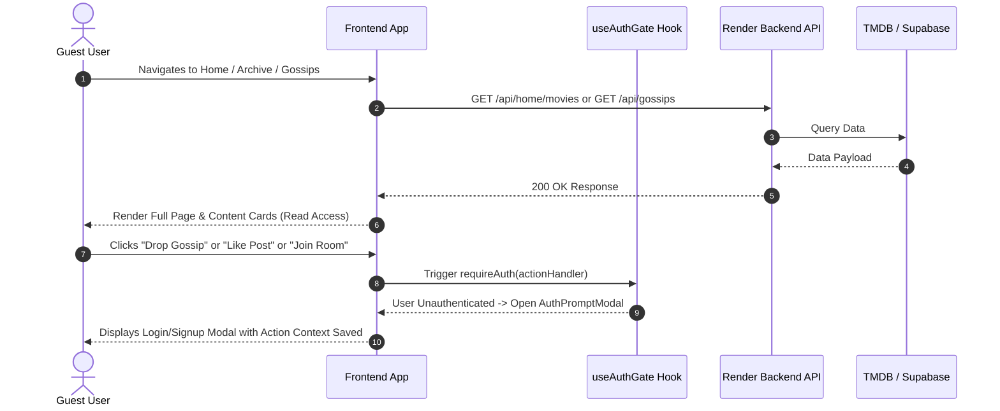
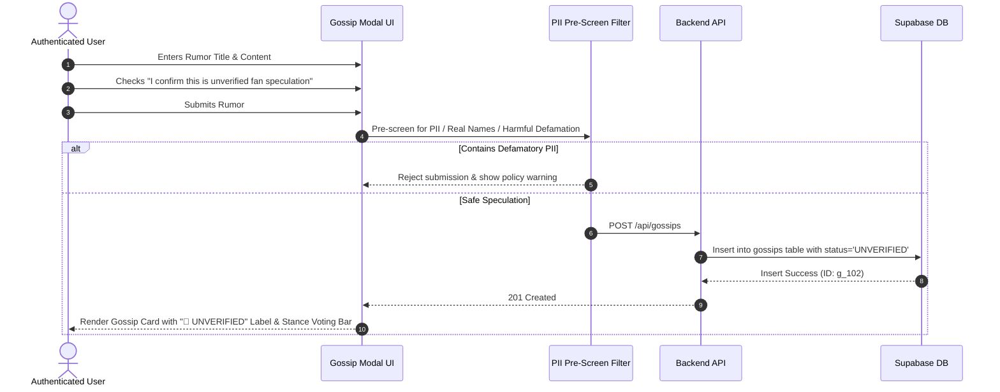
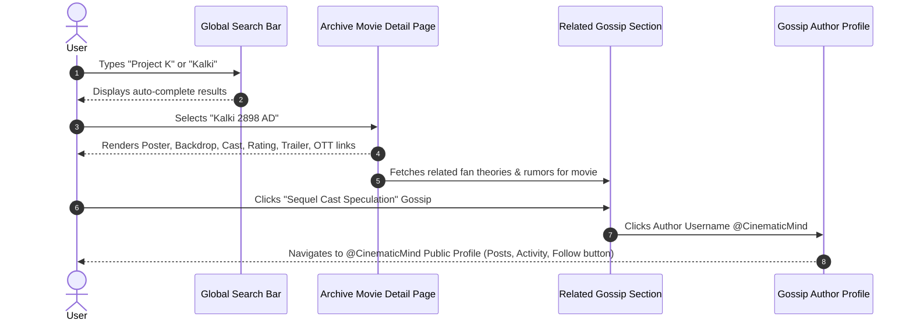

# End-to-End User Journeys — FilmyFrolic

## Core User Journey Verification

### 1. Guest Journey: Unauthenticated Public Exploration & Action Auth Gating

### 2. Gossip Creation Journey: Fan-Created Rumor Protection & Stance Staking

### 3. Movie Discovery to Gossip & Community Integration Journey

